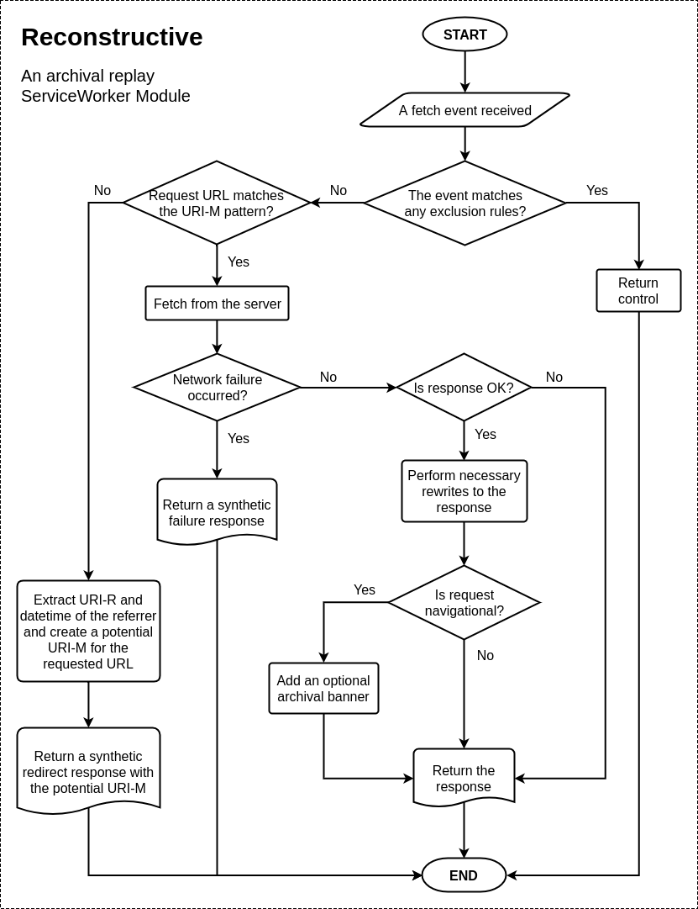

# Reconstructive

Traditionally, web archival replay systems rewrite link and resource references in HTML/CSS/JavaScript responses so that they resolve to their corresponding archival version.
Failure to do so would result in a broken rendering of archived pages (composite mementos) as the embedded resource references might resolve to their live version or an invalid location.
With the growing use of JavaScript in web applications, often resources are injected dynamically, hence rewriting such references is not possible from the server side.
To mitigate this issue, some JavaScript is injected in the page that overrides the global namespace to modify the DOM and monitor every network activity.
We proposed a ServiceWorker-based solution to this issue that requires no server-side rewriting, but catches every network request, even those that were initiated due to dynamic resource injection.

Reconstructive is a [ServiceWorker](https://developer.mozilla.org/en-US/docs/Web/API/Service_Worker_API) module for client-side reconstruction of composite [mementos](https://tools.ietf.org/html/rfc7089) by rerouting resource requests to corresponding archived copies.
This is an implementation of a [published research paper](http://www.cs.odu.edu/~mln/pubs/jcdl-2017/jcdl-2017-alam-service-worker.pdf).
This can be used in archival replay systems such as [IPWB](https://github.com/oduwsdl/ipwb) or in the UI of memento aggregators such as [MemGator](https://github.com/oduwsdl/memgator).

The following figure illustrates an example where an external image reference in an archived web page would have leaked to the live-web, but due to the presence of Reconstructive, it was successfully rerouted to the corresponding archived copy instead.


Read our introductory blog post [Introducing Reconstructive - An Archival Replay ServiceWorker Module](http://ws-dl.blogspot.com/2018/01/2018-01-08-introducing-reconstructive.html) for more details.

## Getting Started

Assuming that your ServiceWorker script (e.g., `serviceworker.js`) is already registered, add the following lines in that script.

```js
importScripts('https://oduwsdl.github.io/Reconstructive/reconstructive.js');
const rc = new Reconstructive();
self.addEventListener('fetch', rc.reroute);
```

This will start monitoring every request originated from its scope and reroute them to their appropriate mementos at `/memento/<datetime>/<urir>` as necessary.
However, the default rerouting might not work for every archival replay system.
So, Reconstructive allows customization to fit to different needs.

## Configuration and Customization

When the script is imported, it provides a class named `Reconstructive`.
An instance from this class can be created with various configuration options.
The instance has following public members:

* `exclusions`   - Object of rerouting exclusion functions.
* `reroute`      - Callback function to be bound on fetch event.
* `rewrite`      - Function to rewrite response to fix any replay issues and add an archival banner.
* `createBanner` - Function to return the banner markup to the `rewrite` function.

### Update Configurations

The `constructor` method of the `Reconstructive` class accepts an object that allows overwriting default configuration options and adding new members as necessary.
Following are the default options:

```js
{
  id: `${NAME}:${VERSION}`,
  urimPattern: `${self.location.origin}/memento/<datetime>/<urir>`,
  bannerElementLocation: `${self.location.origin}/reconstructive-banner.js`,
  bannerLogoLocation: '',
  bannerLogoHref: '/',
  showBanner: false,
  debug: false
}
```

To instantiate an object `rc` with custom configurations, initialize as following:

```js
const rc = new Reconstructive({
  urimPattern: `${self.location.origin}/archived/<datetime>/<urir>`,
  bannerElementLocation: 'https://oduwsdl.github.io/Reconstructive/reconstructive-banner.js',
  bannerLogoLocation: 'https://oduwsdl.github.io/Reconstructive/resources/reconstructive-logo.svg',
  bannerLogoHref: `${self.location.origin}`,
  showBanner: true,
  debug: true,
  customColor: '#0C383B'
});
```

We have updated four existing options and added a new one, `customColor`, which we can use later in our custom logic.

### Adding Exclusions

The `exclusions` property of the class is an object of functions.
Each member of this object checks for certain criteria and returns a boolean to express whether or not the fetch event should be excluded from being rerouted.
Following is the default exclusions object.

```js
{
  notGet: event => event.request.method !== 'GET',
  bannerElement: event => this.showBanner && event.request.url.endsWith(this.bannerElementLocation),
  bannerLogo: event => this.showBanner && this.bannerLogoLocation && event.request.url.endsWith(this.bannerLogoLocation),
  homePage: event => this.showBanner && this.bannerLogoHref && event.request.url === this.bannerLogoHref,
  localResource: event => !(this._regexps.urimPattern.test(event.request.url) || this._regexps.urimPattern.test(event.request.referrer))
}
```

Add more members to the object to add more exclusions or modify/delete existing ones.

```js
rc.exclusions.analytics = event => event.request.url.endsWith('custom-analytics.js');
```

We have added a new exclusion named `analytics` which will return `true` if the requested URL ends with `custom-analytics.js`.
This exclusion will ensure that the request will not be routed to an archived version of the file.
In a practical application such exclusion rules should be kept very tight to avoid any false positives.

### Custom Rerouting

Reconstructive does not register itself as a ServiceWorker, instead it is added as a module to an existing ServiceWorker for archival replay rerouting logic.
Hence, it is possible to have some custom ServiceWorker logic in place while selectively calling `reroute()` function on some requests.

```js
self.addEventListener('fetch', function(event) {
  if (event.requests.url.startsWith('https://example.com/api/')) {
    event.respondWith(fetch(event.request, {
      mode: 'cors'
    }));
  } else {
    rc.reroute(event);
  }
});
```

### Custom Rewriting

Reconstructive has a `rewrite()` method that tries to make necessary changes in the HTML pages to fix some common replay issues and changes hyperlinks to their archival context.
However, there might be times when you need some custom rewriting logic in your archival replay system.
To accomplish this either override the `rewrite()` method of the instance or extend the `Reconstructive` class with an updated `rewrite()` method.
The method is called with original `response` and `event` objects and returns a `Promise` that resolves to a `Response` object.
We are illustrating the first approach below.

```js
const customRewrite = (response, event) => {
  let customResponse = new Response();
  // Do something with the original response to create a custom response.
  return customResponse;
};
rc.rewrite = customRewrite;
```

**Note:** When overriding a method of a class instance the context of `this` inside the custom function could be different (use the instance name e.g., `rc` in place of `this` instead).

### Custom Banner

Reconstructive has a `createBanner()` method that creates a banner markup using [Web Components](https://www.webcomponents.org/).
This markup is then injected into navigational HTML pages by the `rewrite()` method if the `showBanner` configuration option is set to `true`.
However, the default banner might not be suitable for every archival replay system.
This can be updated by overriding the `createBanner()` method the same way as described above for the `rewrite()` method.
Note that the banner is included by the built-in `rewrite()` method, which if overriden, may not include the banner unless `createBanner()` is called by the `customRewrite()` too.

```js
const customCreateBanner = (response, event) => {
  return `<custom-replay-banner background="${rc.customColor}"></custom-replay-banner>`;
};
rc.createBanner = customCreateBanner;
```

As an aside, we used `rc.customColor` here that was an additional configuration option we supplied at the instance initialization.

## How it Works?

In order to reroute requests to the URI of a potential archived copy (also known as Memento URI or URI-M) Reconstructive needs the request URL and the referrer URL, of which the latter must be a URI-M.
It extracts the datetime and the original URI (or URI-R) of the referrer then combines them with the request URL as necessary to construct a potential URI-M for the request to be rerouted to.
If the request URL is already a URI-M, it simply adds a custom request header `X-ServiceWorker` and fetches the response from the server.
When necessary, the response is rewritten on the client-side to fix some quirks to make sure that the replay works as expected or to optionally add an archival banner.
The following flowchart diagram shows what happens in every request/response cycle of a fetch event in Reconstructive.


